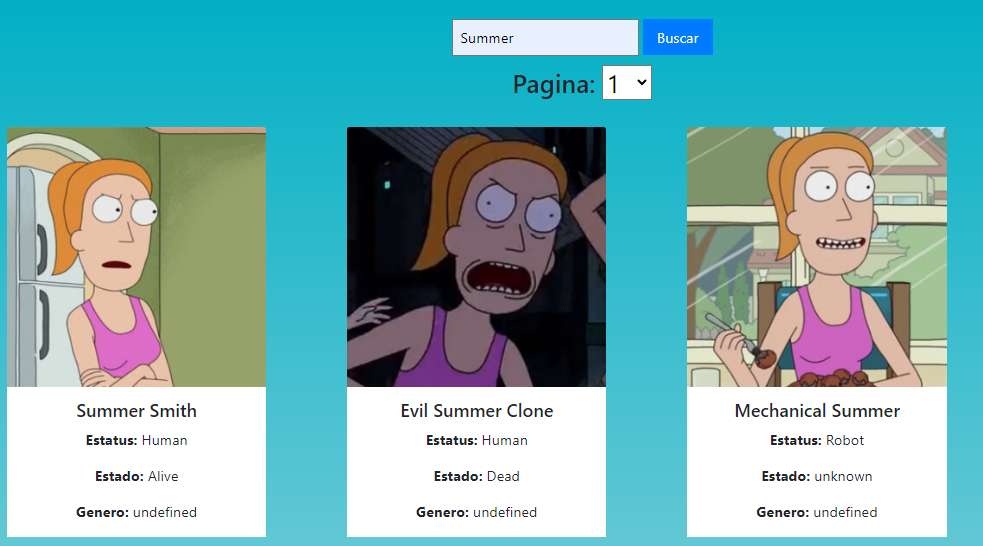

# Guia de uso API Rick y Morty
## **Tabla de contenidos**

- Introducción
- Home
- About us
- API

## **Introducción**

En esta guía de usuario se mostrará cómo usar esta página web de forma sencilla y concisa.  
Esta web tiene tres apartados en el menú de navegación:

 - **Home** 

   
 

 - **About Us**

   
 -  **API**  
 

 Si se quiere acceder rápidamente a la página principal se puede presionar en el logo de RICK Y MORTY en la parte superior izquierda de la página.

 

## **Home**
 Si se presiona en el HOME (que es la página principal) se podrá observar los siguientes apartados:

 - **Carrusel de imágenes**
 

 - **Descripción del proyecto**
  
 - **Programario utilizado**
  

Estando en cualquier apartado de la página web, si se vuelve a presionar en el HOME de navegación, se redirigirá automáticamente allí.

## **ABOUT US**
 Si se presiona en el About Us se podrá observar la información básica sobre los creadores de esta página web.
 

  

Para volver a HOME se deberá presionar en el menú de navegación el boton HOME, o al final de página, en el menú de pie de página, también hay otro botón HOME, o una flecha para atrás.

  

Para avanzar a la API se deberá presionar en API ya sea en el menú de arriba o en el inferior.

## **API**
En este apartado es donde se podrá utilizar la funcionalidad de buscar los personajes de Rick y Morty de toda la serie hasta ahora.
Para usar el buscador, deberemos hacer clic en el buscador para poder escribir el nombre del personaje que se desea encontrar.

Ahora se procederá a poner un ejemplo para ver cómo funciona.

 1. **Clic en el buscador**
 
 2. **Se escribe el nombre del personaje**
 
 3. **Se presiona en buscar o con la tecla ENTER**

 4. **Se podrá visualizar todas las tarjetas del personaje escrito.**
  

Para volver a HOME se deberá presionar en el menú de navegación el boton HOME, o al final de página, en el menú de pie de página, también hay otro botón HOME, o una flecha para atrás.

  

En esta API también se podrá buscar por página.
Debajo del buscador, como se habrá visto en imágenes anteriores, hay un apartado donde aparece PÁGINA y un número.
Es un desplegable, y se podrá visualizar las 42 páginas de personajes que hay disponibles hasta al momento.

  

 Para volver a la página de about us, se hará como en las anteriores veces. 

 Esperamos que os sirva la guia!

	