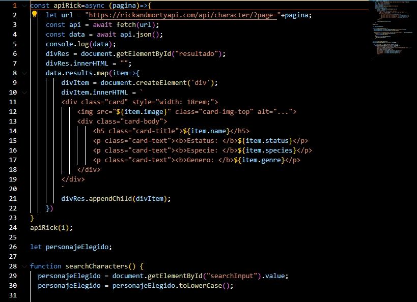

# WEB Rick y Morty

## Documento técnico
#### Aniol Maestre, Eric Portero, Joan Torne
#### 18/04/2024

## **Tabla de contenidos**

- Descripción del proyecto
- Base de datos elegida
- Prerequisitos
- Estructura general
- Descripción de módulos
- Funciones dentro de la web

## **Descripción del proyecto**

El proyecto trata de crear una web con tres pestañas; la de Home, About Us y la API. La parte más interesante es la de la API porque se debe integrar unas funciones que aplican unos filtros.

Pestaña Home: contiene un carousel de imágenes sobre la serie de Rick y Morty, la descripción del proyecto y los programas usados.

Pestaña About Us: segunda pestaña, donde se muestran los integrantes del grupo y una pequeña biografía.

Pestaña de la API: hemos implementado un cambiador de página que muestra los personajes de cada una, porque en total son 42. También existe un buscador de nombre, donde al escribir una letra ya filtra los personajes que tienen esa letra en su nombre.

## **Base de datos elegida**

Nosotros hemos seleccionado la base de datos de Rick y Morty, que es una serie de televisión de animación 2D para adultos, donde se siguen las desventuras de un científico y su nieto con humor negro y ciencia-ficción. Tiene unos colores vivos, saturados y locos como en nuestra web.

La base de datos en si trata sobre una librería online con todos los personajes de la serie, imágenes, localizaciones y episodios. Se coge la información con una función que se detalla más adelante.

Los links para coger la información de la API se basan en tres:

link para coger personajes: **"https://rickandmortyapi.com/api/character"**
coger localizaciones: **"https://rickandmortyapi.com/api/location"**
coger información de episodios: **"https://rickandmortyapi.com/api/episode"**

Nosotros hemos utilizado el link para obtener la información de los personajes. La estructura de donde se ha sacado es la siguiente: 

1. Información sobre la página actual dentro de la API.
2. Resultados de la API dentro de la página actual, como es la información del personaje en si, localización, imagen del personaje, episodio que sale y data de creación.

## **Prerequistios**

Para realizar este proyecto se necesita conocer HTML, CSS y JavaScript (JS).

HTML: En inglés "HyperText Markup Language", es un lenguaje de marcado para la creación de páginas web. Se define con una estructura básica y código HTML
para la presentación de contenido de una página web.

CSS: Los elementos creados con HTML se pueden configurar visualmente con CSS. El formato es en cascada, donde se escoge el elemento y con unas reglas se modifica en vertical.

JS: Es el lenguaje de programación interpretado que hemos usado para el proyecto.
Su uso principal es en aplicaciones web y permite mejoras de interfaz de usuario y páginas web dinámicas.

Tambiém hemos utilizado Bootstrap para realizar el carousel, el footer y las cards de la página de About Us. El Bootstrap es una extensión de CSS implementada con clases de HTML.

Otro recurso utilizado son iconos cogidos directamente de la web, sin la necesidad de descargarlos. Esto es conseguido con los iconos de la web Font Awesome, que se llaman con un link a CSS online.

## **Estructura general**

La estructura del proyecto está realizada en el documento index.html y contiene las siguientes partes: 
(Las imágenes son parte del codigo de forma demostrativa).
1. Head: Parte donde se introducen los links a las distintas páginas del HTML, el CSS general, el de Bootstrap y el de FontAwesome icons. También existen los enlaces al JavaScript, para comunicar todos los documentos.

    

2. Header: Es el encabezado de la página, contiene el icono del título Rick y Morty y el navegador de páginas. 
    

3. Body (main): Es la parte más gruesa y que cambia dependiendo de la página que nos encontramos. En Home trata sobre la descripción del proyecto y los programas usados, en About Us salen los recuadros con nuestra información y en la API existen los botones para cambiar página o buscar por nombre y se imprimen los resultados de la búsqueda.
    

4. Body (Footer): Está el pie de página, con el título de Rick y Morty, la badge WEB, programas utilizados y hecho por más nuestros nombres.
    

5. Script: Se realiza el código para abrir los popovers de la pestaña About Us. Poniendo el código en el HTML conseguimos que siempre esté activo.
    

Con el CSS, se da un estilo a toda la web.
 

## **Descripción de módulos y funcionalidad de la web**

### HTML
#### Index
En la parte del header se creara el nav con botones para acceder a cada apartado de la web

Css del header para dar forma a los botones

El carrusel de imágenes se ha creado con boostrap, donde se ha programado con botones de hacia adelante y hacia atrás.
Seguidamente se hara el contenedor para las imagenes y los botones de abajo de las imagenes para ver en que posición de imágen estamos del carrousel.

El footer esta creado con boostrap. Contiene el box que contendra tanto como la información necesaria en esta sección como un script para los colores parpadeantes.

A continuación, el codigo para la indexación de paginas (atrás, HOME, ABOUT US, API, adelante)

#### ABOUT US
El código que se muestra hace referencia a las cards creadas con boostrap para mostrar información sobre nosotros.
Contendra una imágen e información general sobre nosotros.

#### API
En la API la funcionalidad del buscador estara linkada en los metadatos para usar el script.
En código html, se creara un contenedor donde se pueda escribir y buscar el personaje deseado.

Abajo, se creara el desplegable donde podamos seleccionar de 1 a 42 páginas disponibles de el API. Para ello se hara un for donde haga de index.
Seguidamente un div donde salga el resultado buscado. El div estara con una id "resultado" para crearlo en css. Esta hecho con grid.

### JS
Este apartado del JS, se encargara de buscar el item y crear una tarjeta donde se mostrara la información recojida. Este script se ha creado para poder hacer que el buscador de personajes creado en html tenga la funcionaidad activa y acabe mostrando el resultado.

 

Seguidamente, el personaje elejido sera buscado en la api, cojer los datos y guardarlo en imprimir la ficha, que se creara en la siguiente parte del codigo.
Una vez hecho esto, en imprimir ficha se cargará toda la información del personaje solicitado. 

  

Redactado por: Aniol Mestre, Joan torné.

